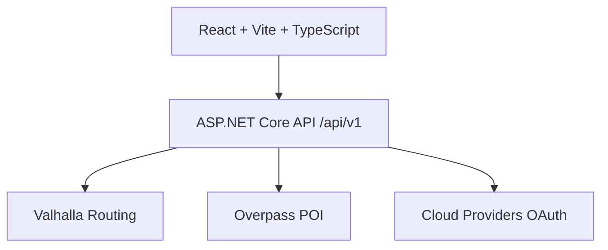

# 🚲 BikeVoyager

Application full-stack de planification d'itinéraires vélo basée sur
**.NET 10** et **React + TypeScript**.\
Déployée sur infrastructure personnelle via **runner GitHub
self-hosted**, Docker et génération automatisée des tuiles **Valhalla**.

[](https://github.com/arnaud-wissart-lab/BikeVoyager/actions/workflows/ci.yml)
[](https://github.com/arnaud-wissart-lab/BikeVoyager/actions/workflows/deploy-manual.yml)
[](LICENSE)


------------------------------------------------------------------------

## 🌍 Démo live

👉 http://bike.arnaudwissart.fr


------------------------------------------------------------------------

## 💡 Pourquoi ce projet ?

BikeVoyager démontre :

-   Orchestration complète d'un moteur de routage (**Valhalla**)
-   Génération automatisée et persistée des tuiles OSM (mode home)
-   Déploiement reproductible multi-machine (runner self-hosted +
    Docker)
-   Gestion propre d'un service externe long à initialiser (bootstrap +
    readiness + 503 contrôlé)
-   API sécurisée orientée production (Origin guard, rate limiting,
    session anonyme)
-   Stack full-stack moderne avec CI complète et tests E2E

------------------------------------------------------------------------

## 🏛 Architecture



------------------------------------------------------------------------

## 📸 Captures

```{=html}
<p align="center">
```
``{=html}
```{=html}
</p>
```
```{=html}
<p align="center">
```
``{=html}
```{=html}
</p>
```

------------------------------------------------------------------------

## 🔧 Stack technique

### Backend

-   ASP.NET Core (.NET 10)
-   Architecture en couches (Domain / Application / Infrastructure)
-   API versionnée `/api/v1`
-   Http Resilience (`Microsoft.Extensions.Http.Resilience`)
-   xUnit (tests unitaires + intégration)

### Frontend

-   React + Vite + TypeScript
-   i18n (FR/EN)
-   Vitest + Playwright (E2E)
-   PWA installable

### Infrastructure

-   Docker multi-services (front + api + valhalla + bootstrap)
-   Runner GitHub self-hosted Linux
-   Déploiement manuel via workflow_dispatch
-   Nginx reverse proxy (NPM)
-   Volume persistant pour les tuiles Valhalla

------------------------------------------------------------------------

## 🏗 Production (home)

Déploiement via GitHub Actions sur infrastructure personnelle.

Stack Docker : - `bikevoyager-front` - `bikevoyager-api` -
`bikevoyager-valhalla` - `bikevoyager-valhalla-bootstrap` (idempotent)

Premier déploiement : - téléchargement extract OSM France - génération
des tuiles - attente readiness (jusqu'à \~20 minutes selon machine)

Vérification :

``` bash
curl http://127.0.0.1:5080/api/v1/valhalla/status
```

------------------------------------------------------------------------

## 🔐 Protection API

-   Origin guard configurable (`ApiSecurity:AllowedOrigins`)
-   Cookie HttpOnly anonyme signé
-   Rate limiting global + endpoints de calcul renforcés
-   Validation stricte des paramètres

------------------------------------------------------------------------

## 🚀 Démarrage rapide

### Stack complète (recommandé)

``` bash
./scripts/dev-up
```

### Backend seul

``` bash
dotnet run --project backend/src/BikeVoyager.Api/BikeVoyager.Api.csproj
```

### Frontend seul

``` bash
cd frontend
npm ci
npm run dev
```

------------------------------------------------------------------------

## 🧪 Tests & Audit

``` bash
./scripts/dev-test
./scripts/dev-audit
npm --prefix frontend run test
npm --prefix frontend run e2e
```

------------------------------------------------------------------------

## 📚 Documentation

-   [Architecture](docs/ARCHITECTURE.md)
-   [API](docs/API.md)
-   [RUNBOOK](RUNBOOK.md)
-   [Audit technique](docs/AUDIT_TECHNIQUE.md)
-   [Security](SECURITY.md)
-   [Changelog](CHANGELOG.md)

------------------------------------------------------------------------

## 🎯 Objectif

BikeVoyager est un projet démonstrateur full-stack mettant l'accent sur
:

-   qualité du code
-   testabilité
-   sécurité API
-   automatisation CI/CD
-   reproductibilité en environnement personnel

Il sert de vitrine technique autour d'une stack .NET moderne orientée
production.
